    

        👈 
    

 

 
Full-Stack Developer, Lawyer and Startup Founder. I like to code, create new concepts and drink beer. Father of two.
  

 

When you follow so many tech and legal "influencers", you can promptly notice that only a handful of them can properly do both. I believe that, as me, there are other <strong>lawyer-developers</strong> out there (or at least some enthusiasts in this niche) that like the idea of having a safe ground to discuss technology applied to the legal field in a way that is between (i) <i>the superficial approach</i> - a "beginners" one used by those who are self-entitled tech lawyers / innovation lawyers - and (ii) <i>a more "technical" or "heavy" approach</i> used by "pure" developers.
 
 
I strive to build solutions thought to and by lawyers, which can potentially impact the way we work. And have fun while doing it. 😁
 
 
<i>Are you a lawyer interested in coding, want to colab in some innovative projects or just want to say hi? Drop me a line at <a href="mailto:octavio@dev.lawyer">octavio@dev.lawyer</a></i> 😉
  

<h3>💻 Current stack</h3>
☑️ Seeking business expansion for <a href="http://mevio.com.br" target="_blank">Mevio</a> 
☑️ Looking for partnerships to expand <a href="https://hubjur.com.br" target="_blank">HubJur</a>'s user base 
☑️ Creating content on Innovation and Programming applied to Law 
☑️ Learning and applying new Marketing strategies 
 

    

	    👈 
    

 

 
Programador Full-Stack, Advogado e Startupeiro. Eu gosto de codar, criar novos conceitos e beber cerveja. Pai de dois.
  

 

Ao acompanhar os "influenciadores" de Direito e tecnologia, é possível perceber que poucos vestem os dois chapéus. Acredito que, assim como eu, há outros <strong>advogados programadores</strong> (ou ao menos entusiastas nesse nicho) que gostam da ideia de um local em que a tecnologia voltada ao Direito pode ser discutida de uma forma intermediária entre (i) <i>a abordagem superficial</i> - de "iniciante" tratada por aqueles que se auto-intitulam advogados da área tech ou de inovação - e (ii) <i>a abordagem mais "técnica" e "pesada"</i> com que conteúdos de tecnologia são apresentados a desenvolvedores.
 
 
Eu busco construir soluções pensadas por e para advogados, que possam potencialmente impactar a forma com que trabalhamos. E me divertir no processo. 😁
 
 
<i>Ei, você é um advogado interessado em programação, quer colaborar em projetos inovadores ou apenas quer mandar um oi? Envie uma mensagem para <a href="mailto:octavio@dev.lawyer">octavio@dev.lawyer</a></i> 😉
  

<h3>💻 Atividade atual</h3>
☑️ Buscando expansão de negócios para o <a href="http://mevio.com.br" target="_blank">Mevio</a> 
☑️ Procurando parcerias par expandir a base de usuários do <a href="https://hubjur.com.br" target="_blank">HubJur</a> 
☑️ Criando conteúdo sobre Inovação e Programação aplicadas ao Direito 
☑️ Aprendendo e aplicando novas estratégias de Marketing 
 

___

## Latest YouTube videos 

<!-- YOUTUBE:START -->

<!-- YOUTUBE:END -->

## Latest Dev.Lawyer posts (Pt-BR)

<!-- BLOG-POST-LIST-BR:START -->
- [5 TEMAS GRATUITOS do Blogger para o site do seu escritório](http://feedproxy.google.com/~r/Brdevlawyer/~3/AIpNRFocBMY/5-temas-gratuitos-para-blogger-site-.html)
- [Como criar uma lista de e-mails em seu site (mailing list)](http://feedproxy.google.com/~r/Brdevlawyer/~3/n0M3Nur2V_E/lista-de-email-mailing-list.html)
- [Como criar uma landing page sem programação](http://feedproxy.google.com/~r/Brdevlawyer/~3/Bi1myxHQ-t8/landing-page-sem-programacao.html)
- [Como criar um site passo a passo grátis](http://feedproxy.google.com/~r/Brdevlawyer/~3/yzhV5n1GhY8/como-criar-site-passoapasso-gratis.html)
- [Como ter um e-mail profissional no Gmail](http://feedproxy.google.com/~r/Brdevlawyer/~3/kh4Lcle869w/email-profissional-no-gmail.html)
<!-- BLOG-POST-LIST-BR:END -->

## Latest Dev.Lawyer posts (En)

<!-- BLOG-POST-LIST:START -->
- [5 FREE Blogger Themes for your firm's website](http://feedproxy.google.com/~r/Devlawyer/~3/pB0tE3pX784/5-free-blogger-themes.html)
- [How to create a mailing list on your website](http://feedproxy.google.com/~r/Devlawyer/~3/hAeOxZS8UPI/create-mailing-list.html)
- [How to create a LANDING PAGE without coding](http://feedproxy.google.com/~r/Devlawyer/~3/9MXoZXKSX4Y/create-landing-page-without-coding.html)
- [How to create a website step by step for free](http://feedproxy.google.com/~r/Devlawyer/~3/390eyI4qODI/create-website-step.html)
- [How to have a professional email address with Gmail?](http://feedproxy.google.com/~r/Devlawyer/~3/UWgiZNKcub8/professional.html)
<!-- BLOG-POST-LIST:END -->

___

## Meet my Active Projects

 

___

## This is my core Skillset

      

## My stats

